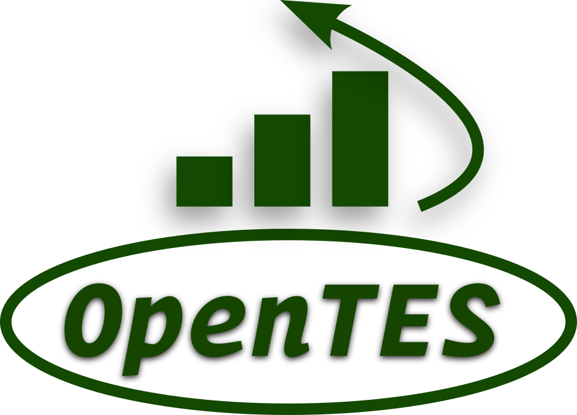
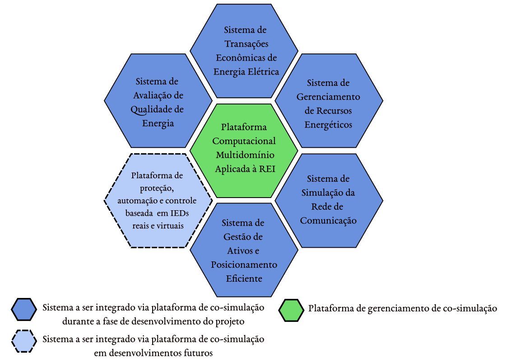

# Projeto OpenTES

Arcabouço Computacional e Tecnológico Aplicado à Redes Elétricas Inteligentes
para a transição Energética (OpenTES).

_Multidomain Computational and Technological Framework applied to Smart Grids
for Energy Transition (OpenTES)._

## Plano de Trabalho

### Equipe do projeto e definição dos papéis de cada membro

1. Ruth Leão \- professora e coordenadora geral do projeto.
2. Raquel Gregory \- professora e supervisora de qualidade de produtos.
3. Janaína Almada \- professora e supervisora de desenvolvimento.
4. Lucas Silveira \- professor e gerente de desenvolvimento.
5. Levi Nogueira \- doutorando e líder de desenvolvimento de software.
6. Luiz Freire \- mestrando e líder de desenvolvimento de software.
7. Luis Felipe \- mestrando e desenvolvedor sênior.
8. Caio Lucas \- mestrando e desenvolvedor sênior.
9. Paulo Victor \- graduando e desenvolvedor júnior.
10. Luiz Alberto \- graduando e desenvolvedor júnior.
11. Rafael Moura \- graduando e desenvolvedor júnior.
12. Francisco Douglas \- graduando e desenvolvedor júnior.
13. Laiza Edwiges \- graduanda e desenvolvedora júnior.
14. IC 6 \- Vaga a ser implementada em caso de necessidade.

O sistema de acompanhamento de projetos do _Github_ será nossa base de acompanhamento e irá centralizar cada etapa de gerenciamento dos projetos.

## Entregas cadastradas no projeto CNPq

Abaixo estão listadas cada uma das entregas cadastradas no formulário de submissão de projeto que foi entregue ao CNPq, destacados os termos que melhor caracterizam cada produto esperado, assim como o status de cada uma.

1. Relatório com revisão sistemática dos temas envolvidos - Em fase final de implementação;
2. Plataforma de Co-simulação multidomínio implementada - Em desenvolvimento;
3. Sistema de Transações Econômicas de Energia integrado à plataforma de co-simulação - Em desenvolvimento;
4. Sistema de Gestão de Ativos da rede elétrica implementada e integrada à plataforma de co-simulação - À ser desenvolvida;
5. Sistema de Gerenciamento da Qualidade de Energia Elétrica - Em desenvolvimento;
6. Sistema de Gerenciamento de Energia pelo lado da Demanda baseado em técnicas de otimização - À ser desenvolvida;
7. Apresentação de atas e relatórios das atividades desenvolvidas e escrita de artigos científicos - Em desenvolvimento.

É a partir dessas **entregas formais** que times de desenvolvimento foram montados para desenvolver os produtos esperados de cada uma.

As entregas do projeto podem ser visualizadas de forma gráfica na Figura 1, que foi gerada na fase inicial de composição do projeto.

Fig. 1: Representação gráfica das entregas propostas na fase de composição do projeto.

## Especificação detalhada das entregas do projeto

Teremos que entregar os artefatos de software listados acima, mas também teremos que entregar pelo menos:

- 2 artigos publicados em periódicos científicos,
- 2 artigos publicados em congressos de nível nacional,
- 4 trabalhos de final de curso,
- 2 dissertação de mestrado e 1 tese de doutorado.

A situação atual das entregas é a seguinte:

- Para a entrega 1 foi realizada uma revisão bibliográfica sistemática com os resultados organizados em um relatório que vem sendo produzido e revisado pelo grupo.
- Para as entregas de 2 a 6 temos seguintes componentes de software já desenvolvidos e que precisam ser melhorados, complementados ou adaptados para cada uma das entregas previstas pelo projeto:
- Sistema de otimização de recursos energéticos em rede que leva em consideração aspectos econômicos, em nível centralizado e distribuído (ADMM), desenvolvido pelo aluno de mestrado Luiz Freire e baseado na biblioteca de fluxo de potência ótimo
    [PowerModelsDistribution.jl](http://PowerModelsDistribution.jl), ferramenta desenvolvida em Julia.
- Sistema de co-simulação desenvolvido na tese de doutorado do professor Lucas Silveira, que desenvolve um sistema de energia transativo baseado em otimização com esquema de decomposição dual e geração de DLMP (Distribution Locational Marginal Prices) com participação de múltiplos mercados de energia elétrica. As principais ferramentas de desenvolvimento são PADE na construção de agentes e Mosaik na co-simulação, ambas bibliotecas Python.
- Sistema de gerenciamento de recursos energéticos distribuídos com controle do tipo Volt/Var desenvolvido no TCC do aluno Caio Lucas. O sistema foi desenvolvido em estratégia de co-simulação utilizando as bibliotecas Python Mosaik, OpenDER, Simbench e Pandapower.

Conforme mencionado nos itens anteriores, com a descrição dos membros do projeto
e com as entregas previstas, as seguintes atividades são propostas:

- Integrar simuladores com a plataforma de co-simulação e simular a rede de
  comunicação.
- Simular a rede elétrica e desenvolver modelo de gerenciamento de recursos
  Energéticos distribuídos (RED).
- Implementar modelo de transações econômicas e modelo de otimização de
  prosumidor com estratégias de gerenciamento de energia pelo lado da demanda
  (GLD).
- Desenvolver interface de visualização de dados para realização de análises de
  Qualidade da Energia Elétrica.

A proposta inicial é que os alunos envolvidos nesse projeto possam ser divididos
em times de desenvolvimento.  
Cada time de desenvolvimento será composto preferencialmente por um professor
supervisor, um ou mais mestrandos e até dois alunos de graduação. Poderão
ocorrer variações nessas composições conforme a necessidade do projeto.  
Os times de desenvolvimento terão a seguinte denominação, de acordo com a
temática que irão abordar:

**Time de simulação de comunicação e integração de simuladores em co-simulação
\- TSCC**  
Breve descrição das atividades a serem realizadas: O principal objetivo desse
grupo é a prospecção de estratégias de simulação dos impactos dos sistemas de
comunicação em uma arquitetura de agentes que precisam trocar informações com
certa quantidade de dados e com requisitos de tempo pré-estabelecidos. Alguns
simuladores de comunicação poderão ser analisados e estudadas suas
características para integração com o sistema de co-simulação que
preferencialmente deverá ser em Python ou que ofereça recursos para recepção de
mensagens via sockets TCP/IP.  
Integrantes:

- Janaína Almada;
- Laiza Edwiges;
- Rafael Moura;

**Time de modelagem e simulação de transações econômicas e otimização de
prosumidores \- TTESO**  
Breve descrição das atividades a serem realizadas: Implementação de modelos de
mercado em co-simulação. Realização de testes com modelos de mercado tipo Pool e
tipo P2P. Implementação de modelo de otimização de recursos multienergéticos
conectados à rede elétrica. Aplicação de modelos de otimização baseados em
programação matemática e/ou meta-heurísticas. Implementação de fluxo de potência
ótimo com decomposição em ADMM  
Leva em consideração restrições da rede elétrica e interpreta multiplicador de
Lagrange como o valor econômico para a manutenção das restrições operacionais da
rede elétrica. Pode ser interpretado como um sistema TES do tipo Pool.  
Integrantes:

- Lucas Silveira;
- Levi Nogueira;
- Luiz Freire;
- Francisco Douglas;

**Time de modelagem e simulação da Rede Elétrica \- TSRE**  
Breve descrição das atividades a serem realizadas: Implementação e teste de
simulador da rede elétrica testando algumas possibilidades como o já integrado
Pandapower e a possível integração de OpenDSS na plataforma utilizando a
biblioteca py-dss-interface. Caio Lucas ficará responsável pelo desenvolvimento
de uma plataforma híbrida de controle de REDs (Controle de Tensão e de fluxo de
potência nas linhas) que irá adotar uma abordagem que mistura controle Volt/Var
distribuído e otimização centralizada.  
Integrantes:

- Lucas Silveira;
- Luis Felipe;
- Caio Lucas;
- Paulo Victor;

**Time de análise da qualidade de energia elétrica e análise de dados de
simulação \- TSDQ**  
Breve descrição das atividades realizadas: Desenvolvimento de simulador para
visualização e análise de dados gerados a partir da co-simulação da rede
elétrica, e eventualmente da rede de comunicação. Realizar análises de qualidade
de energia com base nos dados capturados dos outros simuladores.  
Integrantes:

- Raquel Gregory;
- Luiz Alberto;

Na Figura 2 estão representados de forma gráfica os times de desenvolvimento do
projeto, com os os nomes dos integrantes já definidos e com os bolsistas
identificados apenas por numeração.

![][image1]

Fig. 2: Representação gráfica dos times de desenvolvimento e seus respectivos
objetos de desenvolvimento.

**Organização dos repositórios no GitHub**

Siglas dos times de desenvolvimento:

1. TSCC: Comunicação e Co-simulação.
2. TTESO: Sistemas Transativos e Otimização.
3. TSRE: Rede Elétrica e Recursos Energéticos distribuídos.
4. TSDQ: Visualização de Dados e Qualidade de Energia Elétrica.

Os seguintes repositórios estarão integrados a cada time de desenvolvimento:

1. [https://github.com/grei-ufc/tscc-com-opentes](https://github.com/grei-ufc/tscc-com-opentes):
   Repositório de código para armazenar as soluções desenvolvidas de simulação
   de comunicação.
2. [https://github.com/grei-ufc/tscc-fmi-opentes](https://github.com/grei-ufc/tscc-fmi-opentes):
   repositório de código para armazenar as soluções desenvolvidas de integração
   de simuladores em co-simulação.
3. [https://github.com/grei-ufc/tteso-tes-opentes](https://github.com/grei-ufc/tteso-tes-opentes):
   Repositório de código para armazenar as soluções desenvolvidas de sistemas de
   energia transativos.
4. [https://github.com/grei-ufc/tteso-prosumer-opentes](https://github.com/grei-ufc/tteso-prosumer-opentes):
   Repositório de código para armazenar as soluções desenvolvidas de otimização
   de prosumidor.
5. [https://github.com/grei-ufc/tsre-grid-opentes](https://github.com/grei-ufc/tsre-grid-opentes):
   Repositório de código para armazenar as soluções desenvolvidas de simulação
   da rede elétrica.
6. [https://github.com/grei-ufc/tsre-der-opentes](https://github.com/grei-ufc/tsre-der-opentes):
   Repositório de código para armazenar as soluções desenvolvidas de simulação
   de recursos energéticos distribuídos.
7. [https://github.com/grei-ufc/tsdq-dataview-opentes](https://github.com/grei-ufc/tsdq-dataview-opentes):
   Repositório de código para armazenar as soluções desenvolvidas para
   visualização de dados da co-simulação.
8. [https://github.com/grei-ufc/tsdq-quality-opentes](https://github.com/grei-ufc/tsdq-quality-opentes):
   Repositório de código para armazenar as soluções desenvolvidas para análises
   de qualidade de energia.

Também é importante a criação do repositório de organização do projeto para
registrar algumas questões organizacionais que envolvam o projeto como um
todo:  
[https://github.com/grei-ufc/general-opentes](https://github.com/grei-ufc/general-opentes)
