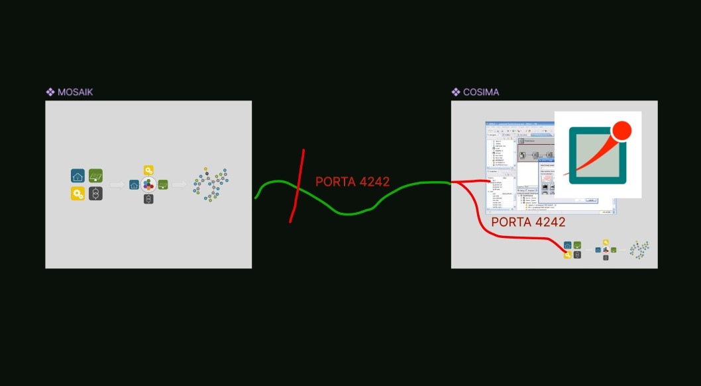

## 📌 Descrição da Atividade
Prosseguimento definido: Em reunião realizada na segunda-feira, dia 2, foi decidido que seguiríamos a abordagem proposta por Rafael Moura, utilizando o container do projeto Cosima juntamente com a criação de um container adicional para o Mosaik. A proposta é executar ambos os serviços em containers separados e estabelecer a comunicação entre eles. Conforme relatado por Rafael na última reunião, e também com o objetivo de consolidar conhecimentos, decidimos reproduzir o exemplo previamente apresentado por ele, no qual ocorre a comunicação entre os containers. Ao executar o exemplo, foi identificado um erro no processo de simulação: o mosaik encerrava sua execução antes que o OMNeT retornasse a resposta da simulação. Após investigação, verificou-se que o problema ocorria porque ambos os serviços estavam tentando utilizar a mesma porta de comunicação.
Embora a porta tenha sido alterada nos arquivos de configuração, durante a execução dos containers ela continuava sendo definida com o mesmo valor para ambos os serviços. Dessa forma, tornou-se necessário especificar/'forçar' explicitamente, no momento da execução do container, a porta que cada serviço deveria utilizar, para a separação correta das portas de comunicação. Segue abaixo o esquemático da situação: 

  
  
<i>Figura: Comunicação entres os containeres.</i>

Inicialmente, essa comunicação estava sendo realizada manualmente. Para facilitar a orquestração dos serviços, decidimos mover o arquivo docker-compose.yml para a raiz do projeto, permitindo aos containers serem gerenciados a partir de um único ponto.
Após essa reorganização, realizamos novos testes utilizando o Docker Compose para iniciar os serviços e verificar se a comunicação entre os containers estava ocorrendo corretamente. 

## 🛠 Contexto Técnico

- **Linguagem/Ferramenta:** (X) Python | ( ) Julia | (X) Docker | (X)
  Outra: C++ (OMNeTpp/INET)
- **Repositório no GitHub**: https://github.com/grei-ufc/tscc-com-opentes
- **Branch de Trabalho:** https://github.com/grei-ufc/tscc-com-opentes/tree/feature/cosima-base
- **Requisito Associado:** (Link para o artigo ou especificação técnica)

## ✅ Checklist de Entrega

- [ ] Código documentado (Docstrings).
- [X] Testes unitários realizados.
- [ ] Container Docker atualizado (se aplicável).
- [ ] Resultados preliminares validados com o Orientador.
- [ ] Outros itens que não foram listados acima: 

## 📈 Resultados / Dificuldades

- **Progresso atual:** 80% [████████░] → 100%
  
- **Bloqueios:** 
## 📅 Prazo Estimado 

- Data de entrega pretendida: 13/03/2026

## 📋 Planejamento para conclusão da entrega

- Passo 1. Finalizar exemplo garantindo a comunicação entre os containeres
- Passo 2. Prosseguirmos com o conhecimento do exemplo finalizado para aplicação com diferentes cenários de simulação
