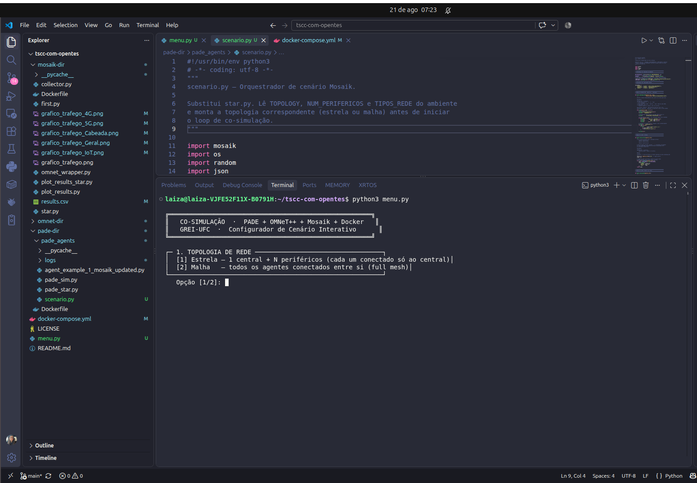

## 📌 Descrição da Atividade
Nessa semana, incrementamos no software as alterações que foram sugeridas na última reunião; diferentes topologias e um menu interativo em que o usuário possa configurar a co-simulação, qual topologia, quantidade agentes e tipos de rede. assim,agora temos um menu como mostrado abaixo;

  
  
<i>Figura:print do menu antes de cosimular</i>

e fizemos a modelagem de mais 2 diferentes topologias, malha e anel.

* **Linguagem/Ferramenta:** (x) Python | (x) C++ | (x) Docker | (x) ZeroMQ | (x) PADE | (x) OMNeT++
* **Repositório Principal:** tscc-com-opentes
* **Status do Ambiente:** Estável / Totalmente Integrado

## ✅ Checklist de Entrega

* [ ] Redação do artigo científico — em andamento.
* [X] Inclusão do menu interativo
* [x] Generalização de Topologia
* [ ] Testes para as diferentes topologias modeladas

## 📈 Resultados / Dificuldades

### **Resultados Alcançados (Pesquisa):**
* 
### **Resultados Alcançados (Software):**

* **Ecossistema Escalável:** A plataforma agora é capaz de instanciar dezenas de agentes PADE dinamicamente, gerando os respectivos clones físicos no OMNeT++ (via `.ned` gerado on-the-fly pelo Mosaik).
* **Física de Rede Realista:** Os agentes agora se comunicam através de perfis físicos de cabo heterogêneos (Wired, 5G, 4G, IoT), com o OMNeT++ aplicando restrições de Packet Error Rate (Drop) e Latência individualmente.
* **Menu:** feitas
* **Topologias:** feitas
### **Dificuldades Identificadas & Solucionadas (Debugging Concluído):**

*

## 📅 Próximos Passos
* **Testes e atualizações:** Precisamos fazer os testes e introduzir esses gráficos e atualizações do software no artigo
---
