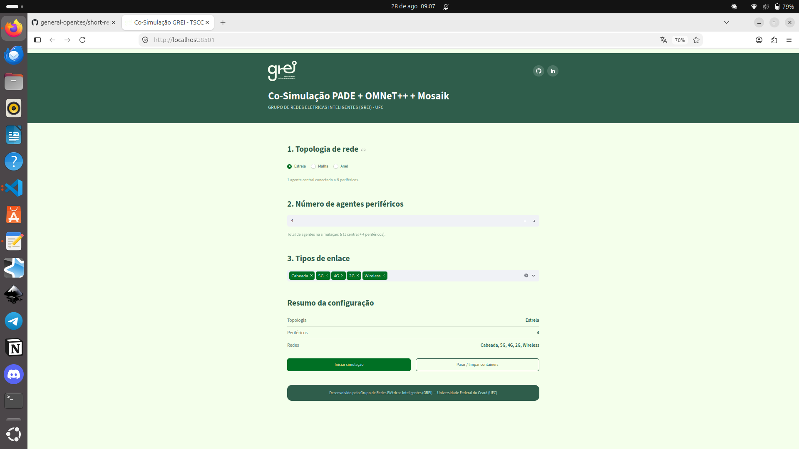

## 📌 Descrição da Atividade
Nessa semana, criamos com o framework Python Streamlit uma interface web, com um menu para que o usuário configure o sistema antes de co-simular, como mostra o print abaixo;

  
  
<i>Figura:print do menu antes de cosimular</i>

- **Linguagem/Ferramenta:** (x) Python | (x) C++ | (x) Docker | (x) ZeroMQ | (x) PADE | (x) OMNeT++ | Streamlit (X)
- **Repositório Principal:** tscc-com-opentes/development
- **Status do Ambiente:** Estável / Totalmente Integrado

## ✅ Checklist de Entrega
* [X] Menu interativo com o usuário para configuração
* [X] Interface web desse menu
* [ ] Testes - *WIP*

## 📈 Resultados / Dificuldades
* Algumas configurações travam e atuam uma co-simulação fantasma

### **Resultados Alcançados (Pesquisa):**
* WIP 
### **Resultados Alcançados (Software):**
* Menu interativo com o usuário para configuração por meio de uma interface web

## 📅 Próximos Passos
* **Testes e atualizações:** Precisamos fazer os testes e introduzir esses gráficos e atualizações do software no artigo
* **Incrementações:** Adicionar os gráficos upados na interface também
---
